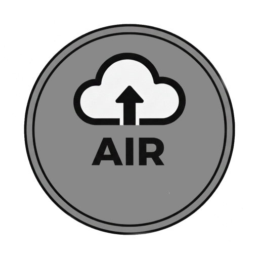
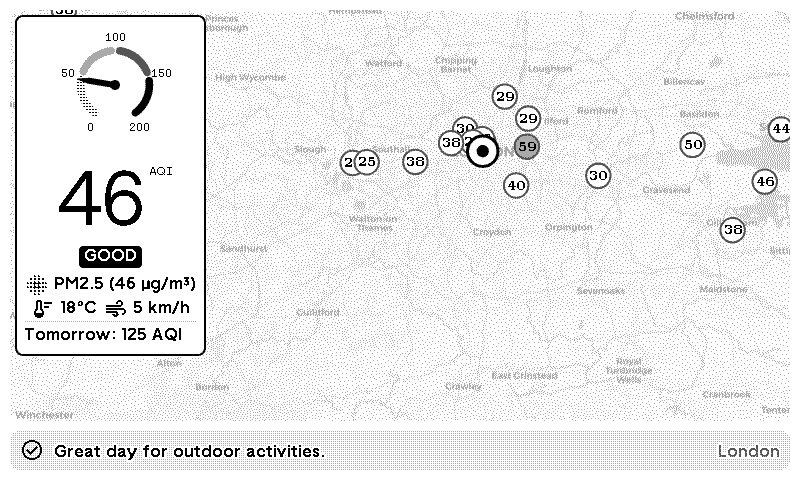

# TRMNL Air Quality Plugin

Display real-time air quality data on your TRMNL device with a beautiful map visualization, gauge, and health recommendations.

## 🌍 Features

- **Real-time AQI data** from 15,000+ monitoring stations worldwide
- **Interactive map** with nearby stations
- **Tomorrow's forecast** included
- **30 languages** supported
- **Health advice** based on air quality level
- **Hosted backend** - no setup required!

## 🚀 Quick Start

1. Install the plugin from TRMNL marketplace
2. Enter your address (e.g., "Brussels, Belgium")
3. That's it! Your display updates automatically

The plugin uses a hosted backend, so you don't need to set up any servers or API keys.

## 🔧 Self-Hosting (Optional)

Want to run your own backend? Fork this repo and:

```bash
# 1. Copy environment template
cp .env.example .env

# 2. Get free API keys
# AQICN: https://aqicn.org/data-platform/token/
# OpenWeather: https://openweathermap.org/api

# 3. Add keys to .env
nano .env

# 4. Deploy with Docker
docker-compose up -d
```

Then update your plugin settings to point to your server URL.

## 📊 Technical Details

- **Backend:** Python/Flask with async support
- **APIs:** AQICN (air quality) + OpenWeather (forecast)
- **Caching:** 15-minute AQI cache, 24-hour forecast cache
- **Database:** SQLite with aiosqlite
- **Deployment:** Docker + Caddy as reverse proxy + Cloudflare Tunnel

## 🔒 Security

The hosted backend only accepts traffic from TRMNL servers. Self-hosted instances can enable IP whitelisting via `ENABLE_IP_WHITELIST=true` in `.env`.

Let me know if there would be any interest for opening up my server for BYOS.

##    Privacy
I like to keep my data safe so here's some information about what data is stored in the backend.

My hosted backend runs on the code that's publicly available in this repository.

The only data is stored is for caching purposes and not linked to your TRMNL account:
- address to latitude and longitude (permanent)
- latest results from the aqicn APIs (15 minute cache)
- latest forecast from the openweathermap APIs (24 hour cache)

In the end, this is my word but there's no way to prove my backend isn't gathering data and you shouldn't just trust an internet stranger.
So feel free to hosting your own backend after reviewing the source code if you have any concerns.

## 📝 License

MIT License - feel free to modify and distribute


<!-- PLUGIN_STATS_START -->
## 🚀 TRMNL Plugin(s)

*Last updated: 2026-02-12 06:52:45 UTC*


##  [Air Quality](https://usetrmnl.com/recipes/193113)



### Description
Monitor air quality in real-time with detailed AQI readings from stations around you and 24-hour forecasts.<br /> Map data: <a href='https://www.openstreetmap.org'>OpenStreetMap</a> & CartoDB.<br /> Air quality data from AQICN/WAQI.

### 📊 Statistics

| Metric | Value |
|--------|-------|
| Installs | 1 |
| Forks | 135 |

---

<!-- PLUGIN_STATS_END -->
